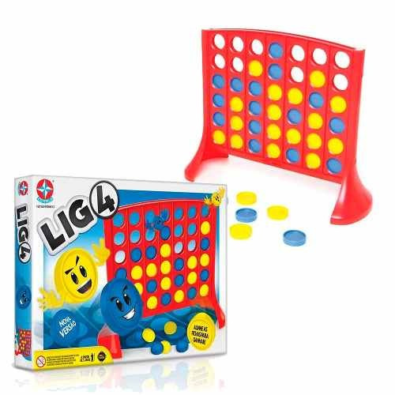

# Implementando um jogador de Connect-4

Liga4 é um jogo popular lançado pela empresa Milton Bradley Company (que foi adquirida pela Hasbro em 1984) em 1974, com o nome de "*Connect Four*". Neste jogo, os jogadores devem colocar as fichas estratégicamente na base, de forma a formar uma sequência com as 4 fichas da sua cor, ao mesmo tempo em que devem prestar atenção para bloquear as tentativas do oponente fazer o mesmo. Liga4 é um jogo para 2 jogadores, recomendado a partir de 5 anos e com duração média de 15 minutos.

<figure>
  
</figure>

**Na aula de hoje você irá**:

- ver um exemplo de jogo de *Connect-4* implementando usando pygame.
- compreender de uma forma introdutória como utilizar o algoritmo [Min-Max](https://en.wikipedia.org/wiki/Minimax) no desenvolvimento de robô capaz de jogar *Connect-4*.

Vá para a próxima [parte](parte1.md) da aula.